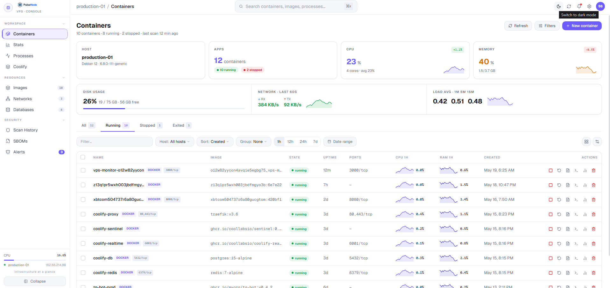

<div align="center">

<picture>
  <source media="(prefers-color-scheme: dark)" srcset="docs/images/logo-dark.png">
  
</picture>

**Open-source VPS control panel — monitor your server, manage Docker, deploy GitHub projects, and secure containers from one dashboard.**

[](https://github.com/SakithaSamarathunga33/PulseNode/releases/latest)
[](https://github.com/SakithaSamarathunga33/PulseNode/actions/workflows/release.yml)
[](LICENSE)
[](backend/)
[](app/)
[](CONTRIBUTING.md)

[Install](#one-command-install) · [Features](#features) · [Why PulseNode?](#why-pulsenode) · [Configuration](#configuration) · [Roadmap](#roadmap) · [Contributing](#contributing)



</div>

---

## One-command install

```bash
curl -fsSL https://raw.githubusercontent.com/SakithaSamarathunga33/PulseNode/main/install.sh | bash
```

The script:
1. Checks Docker and Docker Compose v2 are installed
2. Clones the repo into `~/pulsenode` (or `/opt/pulsenode` when run as root)
3. Detects your server's public IP — one prompt to confirm
4. **Asks you to create an admin login** so your dashboard isn't left open to the internet
5. Optionally sets Coolify API URL and token
6. Writes the config, pulls pre-built images (or builds from source), starts everything behind Caddy on port 80
7. Polls until services are ready, then prints your clickable dashboard URL

When it finishes you'll see:

```
  ✓  PulseNode is live!

  Open in browser  →  http://YOUR_IP/
```

**Re-running the same command updates an existing install** (git pull + rebuild, your login and data are kept).

### Requirements

| Requirement | Version |
|------------|---------|
| Docker | 24+ |
| Docker Compose plugin (v2) | 2.20+ |
| git | any |
| Linux VPS | Any distro with Docker |
| Open port | 80 (or 443 for HTTPS) |

---

## Features

- ⚡ **One-command install** — from empty VPS to live dashboard in minutes, updates the same way
- 📊 **Live system metrics** — CPU, RAM, disk I/O, and network streamed over WebSocket/SSE, read straight from `/proc`
- 🐳 **Full Docker management** — containers, images, networks, logs, stats, and an in-browser shell
- 🚀 **Deploy from GitHub** — connect a repo and deploy on push: Dockerfile, Docker Compose, Nixpacks auto-builds, and `frontend/` + `backend/` monorepos
- 🔄 **Zero-downtime deploys with rollback** — new containers are health-checked before old ones are removed; one click rolls back to any previous build
- 🗄️ **Database management** — spin up and manage PostgreSQL, MySQL, MongoDB, and Redis, or connect existing databases
- 🛡️ **Container security scanning** — Trivy vulnerability scans and Syft SBOMs, per container
- 🔔 **Alerts** — threshold rules on CPU, RAM, and disk with notification channels
- 🌐 **Automatic HTTPS** — Caddy terminates TLS with Let's Encrypt; per-project custom domains
- 🧩 **Coolify integration** — see your Coolify projects and deployments alongside everything else
- 🔐 **Login protection** — bcrypt-hashed admin account, httpOnly JWT sessions, full-dashboard auth gate
- 📈 **Process explorer** — live host process list with real per-process CPU and memory

---

## Why PulseNode?

Running a single VPS usually means juggling three or four tools — one for metrics, one for Docker, one for deployments. PulseNode is one dashboard for the whole box.

| | PulseNode | Portainer | Netdata | Coolify |
|---|:---:|:---:|:---:|:---:|
| Live host metrics (CPU/RAM/disk/net) | ✅ | ❌ | ✅ | ➖ basic |
| Docker containers / images / networks | ✅ | ✅ | ➖ view only | ➖ |
| Git push-to-deploy with rollback | ✅ | ➖ stacks | ❌ | ✅ |
| Container vulnerability scanning + SBOMs | ✅ | ❌ | ❌ | ❌ |
| Database provisioning & management | ✅ | ❌ | ❌ | ✅ |
| Alerts on host resources | ✅ | ❌ | ✅ | ❌ |
| Single-command install | ✅ | ➖ | ✅ | ✅ |

PulseNode doesn't try to manage a fleet of a hundred nodes — it's built to be *the* dashboard for the one or two servers you actually run.

---

## How it works

```
Browser
  │
  ▼
Caddy :80 (or :443 with auto-TLS)
  ├─ /go/*     ──▶  Go API  :4002   (Docker, processes, metrics, auth, databases, projects)
  ├─ /events   ──▶  Go API  :4002   (Server-Sent Events — live metrics)
  ├─ /ws       ──▶  Go API  :4002   (WebSocket — live metrics)
  ├─ /health   ──▶  Go API  :4002   (health check endpoint)
  └─ /*        ──▶  Next.js :3000   (dashboard UI)
```

The Go API mounts `/var/run/docker.sock` and runs in the host PID namespace (`pid: host`) to read real host CPU, RAM, disk I/O, and network stats from `/proc`.

All data is persisted in a single SQLite database (`pulsenode.db`) — credentials, alert rules, audit logs, deployed projects, and the admin account.

All internal services bind on the Docker-internal network only — Caddy is the sole public entry point.

---

## Manual deploy

```bash
git clone https://github.com/SakithaSamarathunga33/PulseNode.git ~/pulsenode
cd ~/pulsenode
./deploy.sh
```

`deploy.sh` prompts for your IP/domain, optional HTTPS, and optional Coolify credentials, writes `.env.local`, then runs `docker compose up -d --build`.

Or configure manually:

```bash
cp .env.example .env.local
nano .env.local
docker compose -f docker-compose.yml -f docker-compose.standalone.yml up -d --build
```

---

## Configuration

All settings live in `.env.local` (created by the installer or `deploy.sh`):

```bash
# Required
NEXT_PUBLIC_ORIGIN=http://YOUR_IP_OR_DOMAIN
NEXT_PUBLIC_GO_API=http://YOUR_IP_OR_DOMAIN/go

# Caddy site address — :80 for IP, domain.com for HTTPS auto-TLS
CADDY_SITE_ADDRESS=:80

# Internal ports (usually no need to change)
WEB_PORT=127.0.0.1:3000
GO_PORT=127.0.0.1:4002

# Security — auto-generated by the installer
JWT_SECRET=<auto-generated>
AES_KEY=<auto-generated>
MASTER_ENCRYPTION_KEY=<auto-generated>

# Optional — require a bearer token on all API routes
GO_API_AUTH=false

# Optional integrations
COOLIFY_API_URL=
COOLIFY_API_TOKEN=
```

---

## Login / Security

PulseNode can control Docker, host processes, databases, and deployments — **always protect it with a login when the dashboard is reachable from the internet.**

The installer asks you to create an admin account during setup. If you skipped it (or deployed manually):

1. Open the dashboard → **Settings** → **Security**
2. Enter a username and password (minimum 8 characters)
3. Click **Enable Login**

Once enabled:
- The entire dashboard is protected — the login page appears for unauthenticated visitors
- Passwords are stored bcrypt-hashed; sessions are httpOnly JWT cookies
- Sessions last **30 minutes of inactivity** and refresh automatically while you're active
- You can change or remove the password from the same **Settings → Security** panel

No `.env.local` changes are needed — the setting is stored in the SQLite database and takes effect immediately.

Found a vulnerability? Please report it privately — see [SECURITY.md](SECURITY.md).

---

## Optional integrations

### Coolify

Set `COOLIFY_API_URL` and `COOLIFY_API_TOKEN` in `.env.local`. The Coolify tab shows real projects and deployment history. Without these values the tab returns an empty list.

### GitHub

Connect a GitHub account from **Settings → GitHub** to deploy projects directly from your repositories. Two methods are supported:

- **OAuth App** — set up a GitHub OAuth App and enter the Client ID and Secret in the GitHub settings page. Best for teams.
- **Personal Access Token (PAT)** — paste a token with `repo` scope. Best for personal installs.

---

## HTTPS / custom domain

Run `deploy.sh`, answer **y** to the HTTPS question, and enter your domain. Caddy handles TLS automatically via Let's Encrypt — no extra tools required.

Requirements: domain DNS must already point to the VPS, and port 443 must be open.

---

## Behind an existing Traefik proxy (e.g. Coolify)

If your VPS already runs Traefik, use the overlay:

```bash
# Add to your .env.local:
TRAEFIK_HOST=vps.example.com
TRAEFIK_NETWORK=traefik   # name of the Traefik Docker network

docker compose \
  -f docker-compose.yml \
  -f docker-compose.standalone.yml \
  -f docker-compose.traefik.yml \
  up -d --build
```

The overlay attaches Caddy to the Traefik network and adds the correct router labels. Caddy still handles internal routing; Traefik only terminates TLS externally.

---

## Architecture

```
pulsenode/
├─ app/                   Next.js 14 app router pages
│   ├─ containers/        Docker container list and shell access
│   ├─ stats/             CPU, RAM, disk I/O, network charts (live)
│   ├─ processes/         System process list
│   ├─ databases/         Managed and connected database management
│   ├─ networks/          Docker network topology
│   ├─ images/            Docker image list
│   ├─ alerts/            Alert rules and notification channels
│   ├─ projects/          Deploy projects from GitHub
│   ├─ coolify/           Coolify projects and deployments
│   ├─ github/            GitHub account connection and OAuth settings
│   ├─ settings/          System settings, updates, and login security
│   └─ login/             Login page (shown when auth is enabled)
├─ backend/               Go API (Chi router, gorilla/websocket)
│   ├─ internal/api/      HTTP handlers — containers, metrics, auth, databases, projects
│   ├─ internal/auth/     JWT signing and validation (HMAC-SHA256)
│   ├─ internal/proc/     /proc reader — CPU, RAM, disk, network, processes
│   ├─ internal/docker/   Docker SDK client — containers, images, networks, exec
│   ├─ internal/db/       SQLite store — credentials, alerts, audit log, users
│   ├─ internal/caddy/    Caddy Admin API client (route management)
│   ├─ internal/builder/  Build pipeline — Dockerfile, Nixpacks, Compose, monorepo
│   ├─ internal/queue/    Async deploy job queue
│   └─ internal/security/ Container security scanning (Trivy / Syft)
├─ components/            Sidebar, stat cards, charts, UI primitives
├─ lib/                   API clients, socket, types
├─ middleware.ts           Next.js edge middleware — auth gate (cookie check)
├─ Caddyfile              Reverse proxy routing rules
├─ docker-compose.yml             Base service definitions
├─ docker-compose.standalone.yml  Exposes ports 80/443 (used by install/deploy)
├─ docker-compose.traefik.yml     Traefik labels overlay (optional)
├─ Dockerfile             Multi-stage: Next.js build only
├─ install.sh             One-command installer (curl | bash)
└─ deploy.sh              Interactive deploy script
```

---

## Tech stack

| Layer | Technology |
|-------|-----------|
| Frontend | Next.js 14, React 18, TypeScript, Tailwind CSS |
| Charts | uPlot |
| Tables | TanStack Table |
| UI components | shadcn/ui, Radix UI |
| Real-time | WebSocket (native) / Server-Sent Events |
| Backend API | Go, Chi router, gorilla/websocket |
| System metrics | Go — reads `/proc` directly |
| Docker API | Go Docker SDK |
| Database | SQLite (modernc.org/sqlite, WAL mode) |
| Auth | HMAC-SHA256 JWT, httpOnly cookie, bcrypt passwords |
| Proxy | Caddy v2 (auto-TLS) |
| Containers | Docker, Docker Compose |

---

## Updating

```bash
# If installed via install.sh — just re-run it:
curl -fsSL https://raw.githubusercontent.com/SakithaSamarathunga33/PulseNode/main/install.sh | bash

# Or manually:
cd ~/pulsenode
git pull
docker compose -f docker-compose.yml -f docker-compose.standalone.yml up -d --build
```

Or use the built-in updater: **Settings → Check for updates**.

---

## Roadmap

- [ ] Two-factor authentication (TOTP)
- [ ] Multi-server monitoring from one dashboard
- [ ] Scheduled database backups
- [ ] More alert channels (Slack, Discord, Telegram)
- [ ] Pre-built ARM64 images
- [ ] Metrics history retention settings

Have an idea? [Open an issue](https://github.com/SakithaSamarathunga33/PulseNode/issues/new/choose) — roadmap priorities follow community demand.

---

## Contributing

Contributions are welcome — from typo fixes to new features. Start with [CONTRIBUTING.md](CONTRIBUTING.md) for the dev setup and PR guidelines, and check the [good first issues](https://github.com/SakithaSamarathunga33/PulseNode/issues?q=is%3Aissue+is%3Aopen+label%3A%22good+first+issue%22).

- 🐛 [Report a bug](https://github.com/SakithaSamarathunga33/PulseNode/issues/new/choose)
- 💡 [Request a feature](https://github.com/SakithaSamarathunga33/PulseNode/issues/new/choose)
- 🔐 [Report a security issue](SECURITY.md)

---

## License

PulseNode is open source under the [MIT License](LICENSE).

---

<div align="center">

**If PulseNode saves you time, [give it a star ⭐](https://github.com/SakithaSamarathunga33/PulseNode) — it helps other self-hosters find it.**

</div>
